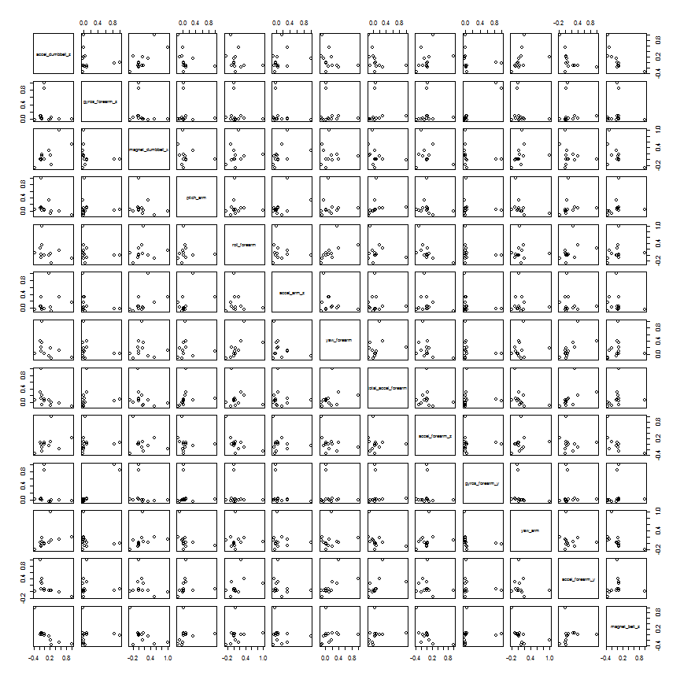

Coursera Practical Machine Learning Course Project
========================================================
# Introduction
This project uses a dataset representing data from accelerometers on the belt, forearm, arm, and dumbell of six (6) participants involved in a study centered around how well, vs how much, participants perform exercies. The goal is to predict a classe depedent variable that has five (5) known states of A through E based in whole or part in 159 other attributes from the dataset.

# Building the Model
## Downloading the data
In this step we are downloading two distinct data sets. The first and larger, is the training set. The training set will later be split into two sub-sections, a set for training, and a set for validating the fit of the trained model in the cross-validation step.

The second dataset is what will be used to perform our predictions against.


```r
download.file("https://d396qusza40orc.cloudfront.net/predmachlearn/pml-training.csv", destfile="pml-training.csv")
download.file("https://d396qusza40orc.cloudfront.net/predmachlearn/pml-testing.csv", destfile="pml-testing.csv")
```

## Load the training & test datasets set from downloaded files
We are simply reading the downloaded files into data frames.

```r
pmlTraining <- read.csv(file="pml-training.csv")
pmlTesting <- read.csv(file="pml-testing.csv")
```

## Subsetting data to extract columns relevant to training and testing
Feature selection is an important step in creating a machine learning model. The approach taken as follows:
<ol>
<li>Remove attributes/features that had near zero values.</li>
<li>Establish correlation values between all the potential features, or independent variables, the in dataset.</li>
<li>Choose only features that had low negative or positive correlation between each other, that is, correlation between -0.01 to 0.01.</li>
<li>Subset training and test data sets based with these attributes.</li>
</ol>


```r
cora <- as.data.frame(cor(subset(pmlTraining, select = c(accel_dumbbell_z, gyros_forearm_z, magnet_dumbbell_x, pitch_arm, roll_forearm, accel_arm_z, yaw_forearm, total_accel_forearm, accel_forearm_z, gyros_forearm_y, yaw_arm, accel_forearm_y,  magnet_belt_z)), subset(pmlTraining, select = c(accel_dumbbell_z, gyros_forearm_z, magnet_dumbbell_x, pitch_arm, roll_forearm, accel_arm_z, yaw_forearm, total_accel_forearm, accel_forearm_z, gyros_forearm_y, yaw_arm, accel_forearm_y,  magnet_belt_z))))
```

This approach strives to ensure that only the indepedent variables that do not explain variances in each other are selected.  Our correlation plot is below.


```r
plot(cora)
```

 

We now apply subsetting to select our independent variables from the data set.

```r
pmlTraining <- subset(pmlTraining, select = c(accel_dumbbell_z, 
                 gyros_forearm_z, magnet_dumbbell_x, pitch_arm,
                 roll_forearm, accel_arm_z, yaw_forearm, total_accel_forearm,
                 accel_forearm_z, gyros_forearm_y, yaw_arm, accel_forearm_y,
                 magnet_belt_z, classe))

pmlTesting <- subset(pmlTesting, select = c(accel_dumbbell_z, 
                 gyros_forearm_z, magnet_dumbbell_x, pitch_arm,
                 roll_forearm, accel_arm_z, yaw_forearm, total_accel_forearm,
                 accel_forearm_z, gyros_forearm_y, yaw_arm, accel_forearm_y,
                 magnet_belt_z))
```

## Partitioning the training data set into training and testing/validation data
We now partition the data into training and validation sets. Training set is used to train the model to predict our dependent variable, classe, while the validation set is used to validate how well the model is trained. We partition 80% of the training data for training, and 20% for cross-validation.

We assign each piece of a variable.


```r
inTrain <- createDataPartition(y=pmlTraining$classe, p=0.80, list=FALSE)
pmlTraining <- pmlTraining[inTrain,]
pmlScoring <- pmlTraining[-inTrain,]
```

## Applying the training method to produce the model
We now train the model on the training data, 80% from above, and assign the results to variable modelFit. Note that the method is svmRadial (SVS radial basis function). We discuss reasons why we choose this method later.

```r
set.seed(1)
modelFit <- train(classe ~ ., data=pmlTraining, method="svmRadial")
```

The model produced from training is below.
## The model produced from training

```r
modelFit$finalModel
```

```
## Support Vector Machine object of class "ksvm" 
## 
## SV type: C-svc  (classification) 
##  parameter : cost C = 1 
## 
## Gaussian Radial Basis kernel function. 
##  Hyperparameter : sigma =  0.0655602115755942 
## 
## Number of Support Vectors : 10139 
## 
## Objective Function Value : -1623 -1818 -1309 -988 -2002 -1630 -1654 -2357 -1451 -1614 
## Training error : 0.16294
```

## Cross Validation
We now use our trained model to predict against the 20% validation data from above. This process is called cross-validation. The Accuracy value shows how well the model was able to predict data in the cross validation set.

```r
predictions <- predict(modelFit, newdata=pmlScoring)
confusionMatrix(predictions, pmlScoring$classe)
```

```
## Confusion Matrix and Statistics
## 
##           Reference
## Prediction   A   B   C   D   E
##          A 839  47  17   7  13
##          B  15 493  49  15  26
##          C  43  42 449 118  32
##          D  10   9  17 374  31
##          E   2  10   4   4 467
## 
## Overall Statistics
##                                        
##                Accuracy : 0.837        
##                  95% CI : (0.823, 0.85)
##     No Information Rate : 0.29         
##     P-Value [Acc > NIR] : <2e-16       
##                                        
##                   Kappa : 0.793        
##  Mcnemar's Test P-Value : <2e-16       
## 
## Statistics by Class:
## 
##                      Class: A Class: B Class: C Class: D Class: E
## Sensitivity             0.923    0.820    0.838    0.722    0.821
## Specificity             0.962    0.959    0.910    0.974    0.992
## Pos Pred Value          0.909    0.824    0.656    0.848    0.959
## Neg Pred Value          0.968    0.957    0.964    0.947    0.961
## Prevalence              0.290    0.192    0.171    0.165    0.182
## Detection Rate          0.268    0.157    0.143    0.119    0.149
## Detection Prevalence    0.295    0.191    0.218    0.141    0.155
## Balanced Accuracy       0.943    0.889    0.874    0.848    0.906
```

## Predicting real data
This final step in building our model is using it to predict against real, or unlabeled data.

```r
predictions <- predict(modelFit, newdata=pmlTesting)
predictions
```

```
##  [1] B A C A A E D B A A C C B A E E A B B B
## Levels: A B C D E
```

# Out of Sample Error

# Why Support Vector Machine (SVM) Radial Basis Function
Linear modeling approaches were not suited for this prediction problem since our dependent variable was not dichotomous, that is, it had more than two possible states. While it would have been possible to create dummies variables to represent each known state, it was also possible to use alternative training approaches such as Support Vector Machines (SVM).  SVMs have several known advantages, over similiar competing approaches such as Naive Bayes or Maximum Entropy.
<ul>
<li>SVM do not require any independence assumptions (Vlachos, 2004).</li>
<li>SVMs are capable of discovering non-linear separating boundaries between classes (Vlachos, 2004).</li>
<li>SVMs accept only numerical features, however categorical features can be used too (Vlachos, 2004).</li>
</ul>

# References
Vlachos, A. (2004). Active learning with support vector machines. Master of Science, School of Informatics, University of Edinburgh, UK.

# End Report
